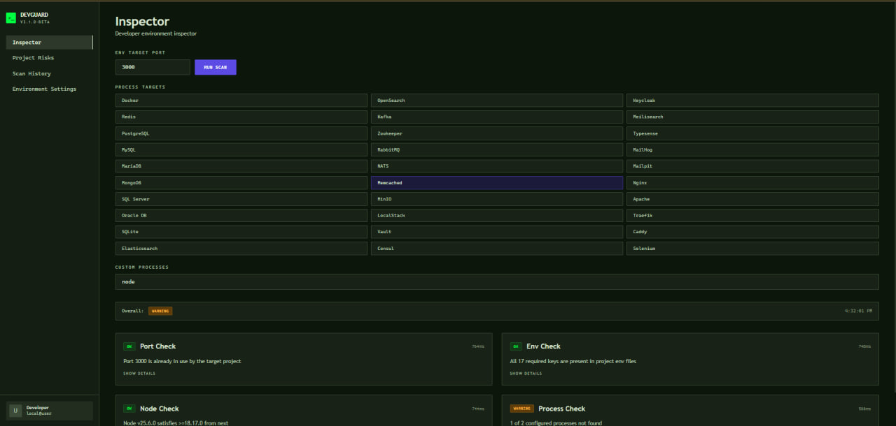
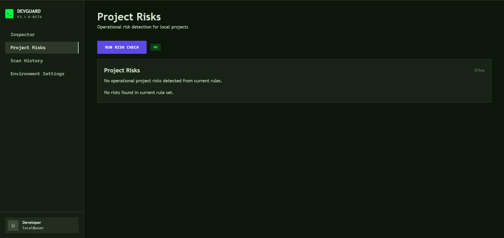
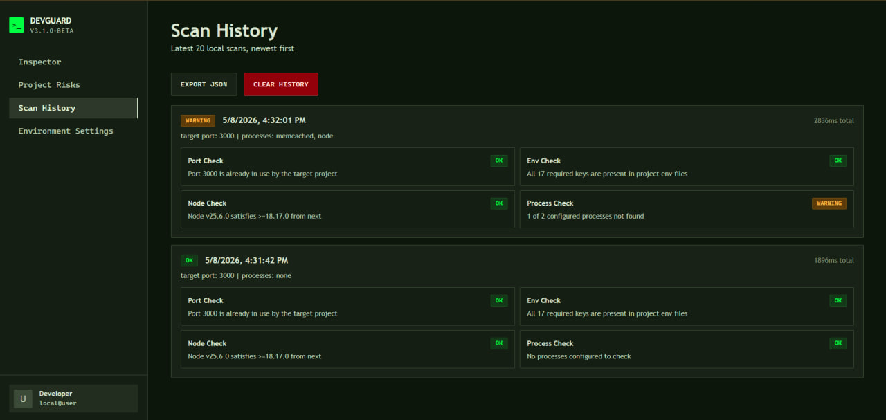
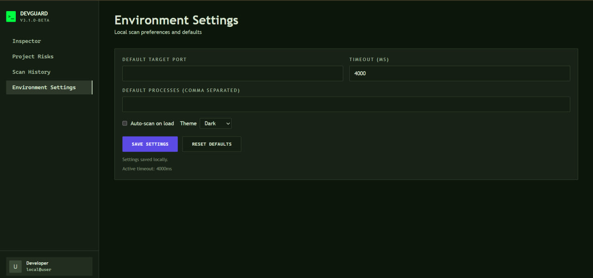

# DevGuard Web

## What It Does
DevGuard Web is a local developer environment intelligence dashboard that helps you quickly verify whether a project is ready to run. It checks ports, env setup, Node compatibility, process dependencies, and local operational risks from one UI.

## Why I Built It
Local setup issues are usually easy to fix but painful to diagnose repeatedly. I built this to reduce startup friction by showing the most common readiness and hygiene problems in one place.

## Tech Stack
- TypeScript
- Next.js 14 (App Router)
- React 18
- Tailwind CSS
- Vitest
- semver
- Node.js runtime APIs for local process/port inspection

## How to Run
1. Clone the repository.
2. Install dependencies:
   ```bash
   npm install
   ```
3. Start the app:
   ```bash
   npm run dev
   ```
4. Open `http://localhost:3000` (or the next available port shown in terminal).
5. Use **Inspector** to run a scan, then review **Project Risks**, **Scan History**, and **Environment Settings**.

Optional:
- Run tests:
  ```bash
  npm run test
  ```
- Build check:
  ```bash
  npm run build
  ```

## AI Tools Used
- Claude
- Codex
- Stitch with Google

## What AI Got Right
- Helped scaffold a clean Next.js structure with most business logic kept in `/lib`.
- Accelerated implementation of check modules and result rendering patterns.
- Made iterative UI refactors faster while preserving existing behavior.

## What I Had to Fix
- Port conflict behavior had to be redesigned to use real OS-level listener detection instead of static assumptions.
- Env validation initially targeted the scanner process env, so I rewired it to inspect target project `.env` files.
- Project Risks had a false positive on `/node_modules` in `.gitignore`; I fixed matcher logic and added regression tests.

## What I Learned About Vibe Coding
- AI is strongest when the architecture is explicit and constraints are clear.
- Fast generation is useful, but correctness still depends on deliberate review and testing.
- The best workflow is treating AI outputs as strong drafts, then validating with real runtime behavior and test coverage.

## Screenshots / Demo
### Inspector (Current Fresh)


### Project Risks


### Scan History


### Environment Settings

